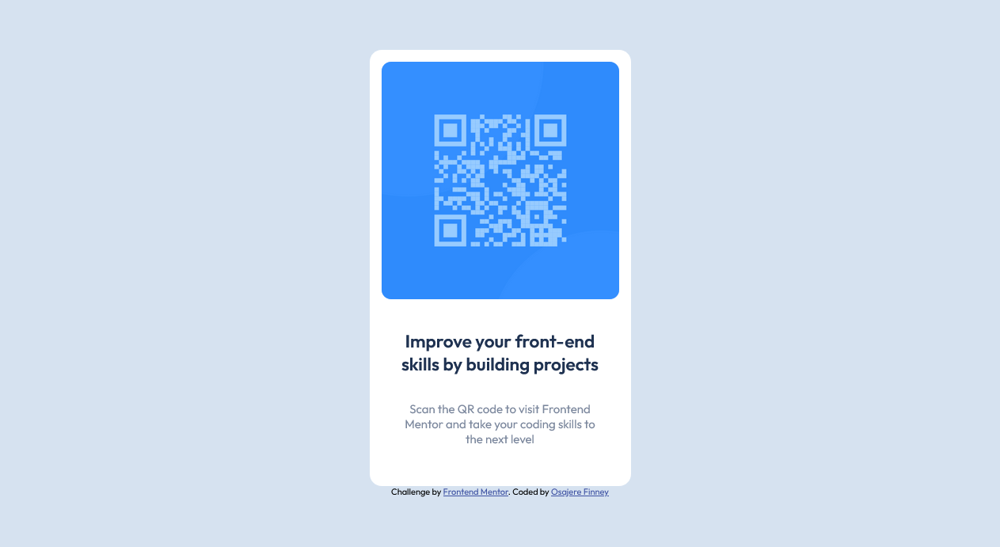

# Frontend Mentor - QR code component solution

This is a solution to the [QR code component challenge on Frontend Mentor](https://www.frontendmentor.io/challenges/qr-code-component-iux_sIO_H). Frontend Mentor challenges help you improve your coding skills by building realistic projects. 


## Table of contents

- [Overview](#overview)
  - [The challenge](#the-challenge)
  - [Screenshot](#screenshot)
  - [Links](#links)
- [My process](#my-process)
  - [Built with](#built-with)
  - [What I learned](#what-i-learned)
- [Author](#author)
- [Acknowledgments](#acknowledgments)


## Overview

### Screenshot

### Desktop Design Screenshot
 

 ### Mobile Design Screenshot


### Links
- Solution URL: [Solution](https://your-solution-url.com)
- Live Site URL: [Live Site](https://your-live-site-url.com)

## My process

### Built with

- Semantic HTML5 markup
- CSS custom properties
- Flexbox


## What I learned

This was my first frontend challenge and was able to learn how to center the card using both flexbox and positioning and translate element.


### Using Positioning

```css
.container {
  position: absolute;
  top: 50%;
  left: 50%;
  transform: translate(-50%, -50%);
}
```
### Using Flexbox
```css
.card {
    max-width: 330px;
    margin: 0 auto;
    display: flex;
    min-height: 100vh;
    align-items: center;
    justify-content: center;
    flex-direction: column;
}

```


## Author

- Frontend Mentor - [@Finney06](https://www.frontendmentor.io/profile/Finney06)
- Twitter - [@Osa_finney](https://www.twitter.com/@Osa_finney)
- Github - [@finney06](https://github.com/Finney06)

## Acknowledgments

All glory to God.

